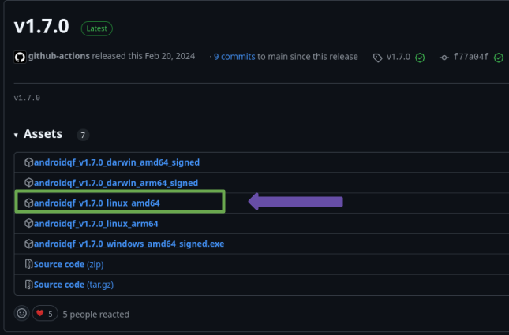
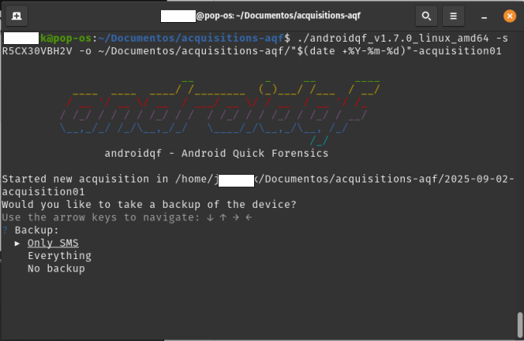
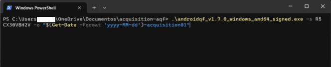
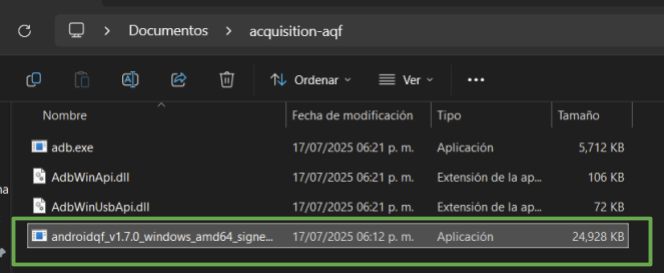

# Tutorial – Exploring AndroidQF for forensic acquisition on Android devices

This document is **part of a technical documentation repository** aimed at building a proven, flexible, and accessible knowledge base to **promote consent-based digital forensics in support of civil society**. To organize all contents we use the technical documentation framework [Diátaxis](../../references/00-glossary/index.md#diataxis).

This resource falls within the [tutorials](https://diataxis.fr/tutorials/) category and provides **guided practical activities** to become familiar with the forensic extraction tool [AndroidQF](https://github.com/mvt-project/androidqf).

The goal of this hands-on tutorial is to **teach how to use AndroidQF to perform forensic extractions on Android devices**, highlighting its usefulness in device analysis and incident response scenarios in support of human rights defenders, journalists, and civil society organizations.

---

!!! tip "How to follow this tutorial?"

    This tutorial is a resource for **learning and exploration**, so concepts are explored in depth, while also presenting alternatives where possible. If you are looking for a concise, step-by-step guide to complete an extraction, refer to our [guide to data acquisition with AndroidQF](../../how-tos/04-how-to-extract-with-androidqf/).

    To follow this tutorial, we recommend you set aside at least **90 minutes of dedicated time** for the initial exploration, especially if you have no prior experience with the tool.

## Requirements to follow this tutorial

To complete this tutorial, you **must** have the following:

* An **Android device**: The device must be functional, and its password, PIN, or unlock pattern must be known. It must also have **USB debugging enabled**.

    !!! question "How to enable USB debugging?"

        If the device does not have this configuration enabled, first follow the steps in [How to enable developer options on different Android devices](../../how-tos/02-how-to-enable-developer-options/), and then follow the guide on [how to enable ADB (USB debugging) on different Android devices](../../how-tos/03-how-to-enable-adb/).

* A **computer** running a recent version of Windows, Linux, or macOS.

* A **USB data transfer cable** in good condition.

    !!! info "Not all USB cables are the same"

        Some USB cables lack the internal connections required to transfer data between the mobile device and the computer. This type of cable will work for charging but not for data transfer. For forensic extractions, make sure you use a cable that allows **data transfer**.

        It can be [difficult to visually distinguish them](https://support.konnected.io/how-to-tell-a-usb-charge-only-cable-from-a-usb-data-cable), but typically, **fast-charging cables** or **those included with devices** tend to support data transfer.

## About AndroidQF

[AndroidQF](https://github.com/mvt-project/androidqf) is a free and open-source software tool **intended to support the forensic extraction of information from Android devices**. It is part of the [MVT Project](https://github.com/mvt-project/), initially developed by [Claudio Guarnieri](https://nex.sx/) and currently maintained by the [Amnesty International Security Lab](https://securitylab.amnesty.org/es/).

AndroidQF stands for *Android Quick Forensics*, and its goal is to **facilitate the acquisition of information when engaging in consented forensic analysis** in civil society contexts.

AndroidQF is a **[portable tool](../../references/00-glossary/index.md#portable-tool)**, meaning it does not need to be installed, and can be executed directly using **Windows, Linux, and macOS** precompiled binaries.

### What does AndroidQF do at a technical level?

Technically, AndroidQF is a forensic [wrapper](https://developer.mozilla.org/en-US/docs/Glossary/Wrapper) around [ADB](../../references/00-glossary/index.md#adb). This means it automates ADB commands, packaged into [modules](https://github.com/mvt-project/androidqf/tree/main/modules) that execute specific operations following a defined workflow. The main components include: 

* **Execution interface.** Displays a command-line interface for user interaction and logs all activity during execution.  
* **Module management.** Handles the execution flow of each module.  
* **Forensic extraction.** Performs forensic data acquisition using adb commands.

### Why is it useful for forensic analysis in civil society?

AndroidQF design allows for **quick and secure extractions of Android devices** without the need for commercial tools or complex configurations, which makes it an accessible and reliable tool for researchers, human rights defenders, journalists, and digital forensic laboratories. 

Some of the key features include: 

* **It is a portable tool**, which means it does not need to be installed.  
* **Forensic data is managed locally**, without relying on any web service or cloud-based storage.  
* Its modularity **allows users to decide exactly what data to acquire**, depending on a person’s level of risk.  
* The tool and its documentation fall under the category of **free and open-source software**, meaning its source code is transparent and can be reviewed by anyone interested in understanding how it works.
* The **ability to verify* what forensic information was extracted** and how the process was carried out **increases transparency and trust**, helping to reduce the technical and ethical risks associated with consent-based forensic analysis.
Complementary to this tutorial, in this repository you will find a [Dictionary of files generated by the androidqf tool](../.../references/01-reference-androidqf-dictionary/index.md), a reference material containing **information about the generated files**, how to use them, where to look for specific information and in what format you will find it.

Complementary to this tutorial, we have also published a [Dictionary of files generated by the AndroidQF tool](../../references/01-reference-androidqf-dictionary/), a reference material that provides **detailed information each of the files generated**, how to use them, where to find specific information, and in what format it can be found.

## Reviewing configurations on the Android device

To begin this tutorial, it’s important to **confirm that the necessary configurations are properly set both on the Android device and the computer**, ensuring a reliable data transmission between devices during the forensic extraction process.

With USB debugging enabled, it’s time to **connect the mobile device to the computer** using the data transfer cable. When you connect the phone, select **Allow** when the Android device **requests permission to access device data.**


/// caption
**Image 1.** Screenshot of an Android Samsung device requesting permission to access data.
///

**On the device**, verify in the notification panel that the device is connected in **USB mode for file transfer** (see image 2). To do this, click on the Android System notification and select *USB for file transfer/Android Auto* (see image 3).  


/// caption
**Image 2.** Screenshot of the notification panel on an Android device.
///

If no notification appears, you can check the **USB settings** in the device’s settings menu and confirm that the _file transfer_ option is enabled.


/// caption
**Image 3.** Screenshot of an Android device showing USB settings for file transfer.
///

## Obtaining AndroidQF

This section explains **how to download the AndroidQF binary and prepare your computer** to run it. Additionally, for those who wish to explore further, this section also includes the steps you need to follow in order to compile your own AndroidQF binary on a Linux system.

### Downloading and installing AndroidQF from the official repository

To begin, you’ll need to download the [binary](../../references/00-glossary/index.md#binary) of AndroidQF from its [official GitHub repository](https://github.com/mvt-project/androidqf/releases/).

It’s important to note that the correct binary depends on **your processor architecture and operating system**. Below are the details for Windows and Linux/macOS systems.

!!! info "Availability on Windows"

    The official AndroidQF repository **only provides the Windows binary for amd64** architecture. Therefore, if your **Windows system runs on an ARM architecture, you won’t be able to continue with this tutorial** unless you have a **Linux or macOS system installed or virtualized** on your computer.

=== "Linux & MacOS"

    Open the terminal and type *uname \-m*. The output of this command will show your processor architecture (x86\_64 or arm64). Image 4 shows an example on a Linux system.

    
    /// caption
    **Image 4.** Screenshot of a Linux terminal showing the output of the *uname \-m* command.
    ///

    Depending on this output, download the corresponding binary from the [official AndroidQF repository](https://github.com/mvt-project/androidqf/releases/). Image 5 shows the download list.

    
    /// caption
    **Image 5.** Screenshot of the AndroidQF download list in the official GitHub repository.
    ///

    Image 6 shows the downloaded file, in this case version 1.7.0. The version may vary as the tool is updated.

    
    /// caption
    **Image 6.** Reference image showing the AndroidQF binary version 1.7.0 downloaded for Linux amd64.
    ///

    Optionally, you can move the downloaded binary to a dedicated folder for the tool or to a folder where you perform forensic extractions, although you can also keep it in your Downloads folder.

    
    /// caption
    **Image 7.** Screenshot of a Linux terminal running the *mv* command to move the downloaded binary.
    ///

    Once the binary is in your preferred folder, you’ll need to grant execution permissions to AndroidQF by using the following command, as shown in image 8:

    ```shell
    chmod +x ./androidqf-XXX
    ```

    
    /// caption
    **Image 8.** Screenshot of a Linux terminal running the *chmod +x* command to add execution permissions to the binary.
    ///

=== "Windows"

    As previously mentioned, for Windows operating systems **only one binary is available**, typically named _androidqf_v1.7.0_windows_amd64_signed.exe_. To obtain AndroidQF, download this file. Image 9 shows a folder containing the downloaded binary (.exe file).

    
    /// caption
    **Image 9.** Screenshot of Windows File Explorer showing the folder with the binary where the forensic extraction will be stored.
    ///

    Optionally, you can move the downloaded binary to a dedicated folder for the tool or to a folder where you perform forensic extractions, although keeping it in your Downloads folder also works.

!!! failure "Antivirus Conflicts"

    If your Windows or macOS computer has an **antivirus** installed, it may prevent or block the download and execution of AndroidQF. 
    Therefore, if you encounter issues downloading or running the binary, we recommend **temporarily disabling your antivirus**. 
    Some antivirus programs may incorrectly flag the AndroidQF binary as a threat and enforce security rules that block its execution.  
    
    If you are using **Windows Defender, it is not necessary to disable it.**


### Alternative: Compiling the AndroidQF Binary for Linux

Additionally, this tutorial presents an alternative way to obtain the AndroidQF binary: **compiling the source code to produce a binary** for Linux. This option allows you to generate the executable file directly on your system, avoiding dependence on the binaries published in the official releases.

This step is **not mandatory**, but it is useful if you want to understand how to use the source code to build the executable file. If you prefer not to explore compilation, or if you are using a Windows system, **you can skip ahead** to the section on [exploring and running AndroidQF](#).

!!! Tip "Integrity of the AndroidQF Binary"

    Compiling the project from source code allows you to **verify the integrity of the software**.

**Step 1 - Update the system**

Use the package manager to make sure packages are up to date.

```shell
sudo apt update && sudo apt upgrade -y
```


**Step 2 - Install the required dependencies**

Install Go 1.23, make, git, unzip, and wget. It’s important not to use the Go version included in the system repositories, as it is usually outdated.

If you already have a previous installation, remove it with:

```shell
sudo apt remove --purge -y golang-go golang
sudo rm -rf /usr/local/go
```

Now download and install the official version of Go. In this example, version 1.23 is used, but always **download the most recent one**.

```shell
cd /tmp
wget https://go.dev/dl/go1.23.1.linux-amd64.tar.gz
sudo tar -C /usr/local -xzf go1.23.1.linux-amd64.tar.gz
```

Add go to the system PATH: 

```shell
export PATH=/usr/local/go/bin:$PATH
```

You can then confirm the installed version of Go. 

```shell
go version
```

**Step 3 - Clone the repository**


With the environment ready, clone the official AndroidQF repository from GitHub and navigate into the downloaded folder.

```shell
cd ~
git clone https://github.com/mvt-project/androidqf.git
cd androidqf
```

**Step 4 - Compile the binary** 


Within the project, the first step is to compile the collector module, which is the module that handles the forensic extraction on the device.


```shell
make collector
```

Wait until the collect finishes building up, as shown on image 10. 


/// caption
**Image 10**. Screenshot of a linux terminal running the command *build collector.*
///


Subsequently, the Linux version of AndroidQF is compiled using the command _make_, as shown in Figure 11.


```shell
make linux
```


/// caption
**Image 11**. Screenshot of a linux terminal running the command *make linux.*
///

At the end of the compilation, the binaries are generated inside the *build* folder. You can list the folder and verify the compilation of the binaries with the following command, as shown in Figure 12:

### Encryption of extractions (optional)

When performing a forensic data extraction from a device, private information is collected, since AndoridQF has the ability to generate backups of SMS messages, list the applications installed on a device or show the paths where the extraction has been performed, revealing the name or pseudonym of the person who performed the procedure, This is why sending this information unencrypted can expose the person who is accompanied in the extraction process, as well as the accompanying party, which in some contexts can compromise the digital or physical security of a person.
```shell
In these scenarios, AndroidQF offers an automatic encryption alternative using [AGE encryption keys](https://github.com/FiloSottile/age) on an extraction to be performed.
ls build/
Using this encryption alternative, AndroidQF can detect a public key with which it first compresses the extract to .zip, subsequently encrypts the archive with *AGE* and removes the unencrypted extract resulting in an archive in the format: **.zip.age**.
```
If you are a person who is going to make a withdrawal on behalf of an organization or other analyst and you are going to use their key to encrypt withdrawals, follow these steps:** ** ** If you are a person who is going to make a withdrawal on behalf of an organization or other analyst and you are going to use their key to encrypt withdrawals, follow these steps

* Requests the corresponding public key from the analyst or user who plans to decrypt this information.
    * Verify that the key starts with *age1...*.

* Create a *.txt* file named **key** in the directory where the AndroidQF binary is located.
    * Place the public key in this file and save the changes.
/// caption
It is important to mention that once the information from this extraction is encrypted, only the person who has the private key will be able to decrypt this information.
**Imagen 12**. Screenshot of a linux terminal running the command *ls build/.*
**If you are an analyst or the person who will receive the information from the extractions** as a first step you should download and install *age*, the [official documentation](https://github.com/FiloSottile/age) mentions the necessary commands for different operating systems and package managers, *apt* for example:
///

apt install age
At this point, **you have generated the binary file** necessary to complete an AndroidQF extraction. In the next section we will explore the tool and confirm the generated binary works properly. 

Additionally, this same documentation mentions the use of precompiled binaries and the full operation of this encryption tool.
## Exploring and running AndroidQF
For the purposes of this tutorial, it is only necessary to generate a pair of keys, a public one (the one you share and with which the information is encrypted) and a private one (with which the information is decrypted), using the following command:

### Exploration of AndroidQF
age-keygen -o my-key.txt

In this section, we will explore AndroidQF to understand the execution parameters of the tool. **Understanding them will allow you to control and customize the type of forensic extraction you want to perform**, as these parameters are part of the commands that guide the tool to function correctly.
The output will create the file *my-key.txt*, which will contain the timestamp of the key creation, the public key and the private key.

In order to encrypt the extractions, you need to follow the steps below:
AndroidQF includes a complete list of available parameters through its *--help* parameter (or its shorthand *-h*). This works on Linux, macOS, and Windows using the following command:
* Create a *.txt* file named **key** in the directory where the AndroidQF binary is located and keep it open.
* Open the file *my-key.txt* and copy the public key which starts with: *age1...*
* Paste the key in the *key.txt* file and save the changes you made
* Share this key with anyone who needs to encrypt extractions or use it when generating extractions with AndroidQF.

**If you are the one who decrypts information, you need to follow the steps below:
```shell
* Create a *.txt* file named **private.key** in the directory where the AndroidQF binary is located and keep it open.
* Open the file *my-key.txt* and copy the private key which starts with: *AGE-SECRET-KEY-...*.
* Paste the key in the *private-key.txt* file and save the changes you made
* Execute the following command in order to decrypt information:

./androidqf_vXXX_ --help
    $ age --decrypt -i ~/path/to/privatekey.txt -o <UUID>.zip <UUID>.zip.age
```
Although this encryption process is optional, it is recommended that it be considered to reduce [potential risks](../../explainers/02-explainer-risks-threats/index.md).

=== "_help_ command in Linux/MacOS"

    Output of help command in Linux:

    
    /// caption
    **Image 13**. Screenshot of a linux terminal running AndroidQF with the parameter *–help*.
    ///

=== "_help_ command on Windows"

    Output of help command in Windows: 

    In the folder where you have saved the AndroidQF binary, right-click and select the option "Open in Terminal," as shown in image 14:

    
    /// caption
    **Image 14**. Screenshot of a Windows folder with the right-click menu open and the *Open in Terminal* option highlighted
    ///

    Once in the terminal, you can execute the command with the *–help* parameter, as shown in image 15.

    
    /// caption
    **Image 15**. Screenshot of Windows Powershell terminal with the *–help* parameter executed.
    ///

The most important options and parameters for conducting a forensic extraction are:

* *\-s*: If you have multiple devices connected, you can use this parameter to specify which device to analyze.

=== "Identifying devices in Linux/MacOS"

    In the case of macOS and Linux, you can list devices using adb. Here is a guide on [How to install ADB on macOS and Linux](https://www-xda--developers-com.translate.goog/install-adb-windows-macos-linux/?_x_tr_sl=en&_x_tr_tl=es&_x_tr_hl=es&_x_tr_pto=tc).

    The command to list devices on macOS and Linux is:

    ```shell
    adb devices
    ```

    The result is shown in image 16.

    
    /// caption
    **Image 16**. Screenshot of Linux terminal with the *adb devices* command executed
    ///

=== "Identifying devices in Windows"

    In the case of Windows, when you run the AndroidQF binary for the first time, the ADB executable is created and can be used to list connected devices:

    ```shell
    .\adb.exe devices 
    ```
    
    The result is shown in image 17.

    
    /// caption
    **Image 17**. Screenshot of Windows PowerShell terminal with the *adb* executable and *devices* parameter executed
    ///

    Once the connected devices are identified, it is possible to add the serial number using the -s parameter, as shown in image 18.

    ```shell
    ./androidqf -s numero-serial
    ```

    
    /// caption
    **Imagen 18**.  Screenshot of a linux terminal with the parameter *\-s*.
    ///

* \-o: Allows you to specify an output or destination folder where the extracted files will be saved.  

    If no output or destination folder is specified, **AndroidQF will identify the device once USB debugging is enabled and will generate a folder with a unique identifier (UUID)**. This folder will store the extraction. The names of these folders, being UUIDs, usually look like 0caba18f-20a7-48d0-b9ba-724fdaa3ff85 or a577ae94-0a47-479c-82c5-c8017bfb7175.

    As an example in this tutorial, the ** *\-o* parameter is used to define the output folder for the extraction** instead of letting AndroidQF generate a UUID. This way, the command will create a folder with a more readable name, combining the date in year-month-day format with an additional identification text at the end, in this example *acquisition01*.

    ```shell
    ./androidqf -s numero-serial -o "$(date +%Y-%m-%d)"-identificador
    ```

    
    /// caption
    **Image 19**.  Screenshot of a linux terminal with the parameter *\-o*.
    ///

* *\--verbose* or *\-v*: Optionally, you can enable verbose mode. The terminal will display real-time information about the process, which is useful for debugging. This information is the same as what is saved in the [*command.log*](https://forensics.socialtic.org/references/01-reference-diccionario-androidqf/01-reference-diccionario-androidqf.html#commandlog) file, which is automatically generated after each execution.

    ```shell
    ./androidqf -s numero-serial -o "$(date +%Y-%m-%d)"-complemento-opcional -v
    ```

    
    /// caption
    **Image 20**.  Screenshot of a linux terminal with the parameter *\-v*.
    ///


### Running AndroidQF

When you are ready to execute the AndroidQF binary, **turn on and unlock the mobile device** that you have already connected to your computer.

Regardless of which operating system you use on the computer, it is first necessary prepare the command that we will execute with the correct parameters depending on the analysis needs. In this case, we use the following command:

```shell
./androidqf -s numero-serial -o /ruta/de/salida/"$(date +%Y-%m-%d)"-complemento # (1)!
```

1. We use the **-s** parameter to specify the serial number and **-o** to indicate the output path. We also use the **date** command to automatically include the date in the folder name.

=== "Running on Linux/MacOS"

    To run AndroidQF on a Linux or MacOS system, open a terminal in the location where the binary is stored and execute the command shown above.


    ```shell
    ./androidqf -s numero-serial -o /ruta/de/salida/"$(date +%Y-%m-%d)"-acquisition01
    ```

First, in case you use [encryption](#encryption-of-extractions-optional), make sure that the encryption key is located in the corresponding folder next to the AndoridQF binary.
    In image 21, we show an example of the output on a Linux system.
In addition, no matter which operating system you use on your computer, it is first necessary to identify the parameters of the AndroidQF run command according to your analysis needs. For this example we use the following command:

!!! note "Note on the example".
    
    For this tutorial, the command that identifies the device by serial number and outputs a folder with date and identifier will be discussed. The detailed version will be omitted for readability.
    /// caption
    **Image 21**. Screenshot of Linux terminal with prepared execution command.
    ///

=== "Running on Windows"

    You can run AndroidQF on Windows using the terminal or the file explorer.

    === "Terminal"

        With your terminal open in the folder where the AndroidQF binary is located, execute the binary using the command with the necessary parameters according to your analysis (similar to the Linux and MacOS case).

        ```shell
        ./androidqf.exe -s serial-number -o "$(Get-Date -Format 'yyyy-MM-dd')-acquisition01
        ```
        
        
        /// caption
        **Image 22**. Screenshot of Windows PowerShell terminal with prepared execution command.
        ///  

    === "File explorer"

        In the folder where the binary is saved, you can run it by double-clicking.

        
        /// caption
        **Image 23**. Screenshot of File Explorer with the folder containing the AndroidQF binary.
        /// 
    

    
    Once you execute the binary, a **Windows protection message** will appear stating that the system prevented the application from running to avoid risks. However, since AndroidQF is a free and open-source tool with constant updates, it is not a commercial distribution.

    Click **“More info”** 

    
    /// caption
    **Image 24**. Screenshot of Windows protection popup.
    /// 

    Select **“Run anyway”**

    
    /// caption
    **Image 25**. Screenshot of Windows protection popup with *Run anyway* selected.
    ///


### Considerations During Execution

!!! info "Equivalent steps for all systems"

    The following steps apply **the same way** across the three operating systems considered in this tutorial: **Linux, Windows, and macOS.**    

This section covers actions and considerations **once execution begins**, that is, as soon as we run the command shown in the previous section. 

When execution starts, some configurations must be made in the terminal (:octicons-terminal-16:) and others on the Android device (:material-cellphone-basic:). These configurations are sequential, so it is **recommended to stay alert during the extraction process**. 

1. **:material-cellphone-basic: - On the phone:** When the message ***Allow USB debugging?*** appears, click ***“Always allow from this computer”*** and then ***“OK”*** or ***“Allow”***.  

    
    /// caption
    **Image 26**. Screenshot of Android Samsung device requesting debugging and trust permission to transfer files.
    /// 


2. **:octicons-terminal-16: - In the terminal:** AndroidQF will then ask what type of backup it should perform:

    * **Only SMS**: Performs a limited backup including only SMS and MMS messages.  
    * **Everything**: Executes a full device backup via adb backup.  
    * **No Backup**: Skips backup generation entirely; only extracts other artifacts via ADB.
	  
    !!! note "Note"

        For this example, we use the **Only-SMS** option to limit extraction to messages, reducing unnecessary exposure of personal data. If the case context is high-risk or requires more sophisticated investigation, it is recommended to choose **Everything**, although **Only-SMS** is sufficient in most cases for detecting phishing attempts via SMS. Please also be aware that the backup function used in this command has been deprecated, and **is not used commonly** by the majority of applications. 

    
    /// caption
    **Image 27**. Screenshot of Linux terminal with AndroidQF backup menu and *Only-SMS* selected.
    /// 


3. **:material-cellphone-basic: - On the phone:** When selecting the backup type, the phone will request a temporary password for encryption. In this example, we use **the password “sd”** (digital security), as shown in figure 28. 

    !!! note "About Backup Passwords"

        At this step, the tool asks for a password to encrypt the backup. In this example, we use "sd" (digital security in Spanish). Depending on the context and the case, you can choose an appropriate password. If extractions are performed continuously, the same password may be used internally by your team.

        Although reusing passwords is not recommended in digital security practices, it is important to consider the context. This password protects only one of the files included in the forensic extraction. Other collected files are not encrypted, so regardless of the password used, the extraction folder should be treated as sensitive information and stored only on media with additional protection measures according to your internal policies.

    
    /// caption
    **Image 28**. Screenshot of Android Samsung device requesting temporary backup password.
    /// 


4. **:material-cellphone-basic: - On the phone:** Next, select the button **“Back up my data.”**

    
    /// caption
    **Image 29**. Screenshot of Android Samsung device with “Back up my data” option selected.
    /// 

    In the terminal :octicons-terminal-16:: At this point, AndroidQF will perform the backup and collect information from the backup and the installed apps (packages) on the device.

    !!! warning "Path Errors"

        Occasionally, errors may appear related to locating package paths, which may show some error markers. However, **these errors do not affect the forensic data extraction from the device.**

    
    /// caption
    **Image 30**. Screenshot of Linux terminal showing collection of application package information by AndroidQF.
    /// 

5. **:octicons-terminal-16: - In the terminal:** Once AndroidQF identifies all installed packages, it will ask what type of app copies to perform. There are three options:  

    * **All**: Downloads APKs of all applications, including system apps.
    * **Only non-system packages**: Downloads only APKs installed by the user.
    * **Do not download any**: Skips APK download entirely.

	  
	The recommendation here is to download only non-system packages to allow later analysis for malicious behavior, modifications, trackers, etc.

    !!! note "Which Option is Ideal?"

        While we recommend selecting “Only non-system packages,” the choice depends on your analysis focus. For sophisticated attack cases, the “All” option may be used.*

    
    /// caption
    **Image 31**. Screenshot of Linux terminal with AndroidQF app package copy menu and *Only non-system packages* selected.
    /// 


6. **:octicons-terminal-16: - In the terminal:** After selecting the package download option, AndroidQF will ask whether to remove APKs signed by developers or trusted entities (like Google or the device manufacturer) to reduce extraction folder size.

	  
	Respond “Yes” so that the review can focus on potentially suspicious packages and save time and storage space.

    !!! note "Which Option is Ideal?"

        While we recommend selecting “Yes,” the choice depends on your analysis focus. For sophisticated attack cases, “No” may be used.
    
    
    /// caption
    **Image 32**. Screenshot of Linux terminal with AndroidQF trusted app omission menu and *Yes* selected.
    /// 

    At this point, multiple acquisition tasks will be performed, such as collecting device properties, system logs, running processes, configurations, temporary files, etc., which will be explained in greater detail in the next section.

    !!! info "Process Duration"
    
        **This stage may take several minutes or even a few hours**, depending on the phone model and amount of stored data. Progress is shown line by line in the terminal and requires no further intervention except at the end, where pressing Enter completes the process.

    
    /// caption
    **Image 33**. Screenshot of Linux terminal showing correct forensic extraction execution with AndroidQF, prompting to press *“Enter”* to finish.
    /// 

Once the acquisition process is complete, the tool will captured the files and key information necessary for a [triage](../../references/00-glossary/index.md#triage). 

## Verifying the extraction

Once the execution of AndroidQF has finished, it is important to validate that the acquisition was completed successfully. To do this, follow these steps:

1. Review the *command.log* file

    Open the *command.log* file with a text editor and search for the words *WARNING* and *ERROR* to find alerts during the extraction. If matches are found, check whether they correspond to critical failures or non-relevant events.

    === "On Linux/MacOS" 
        
        You can use the *grep* command to search within the acquisition folder:

        ```shell
        grep -i "WARNING\|ERROR" command.log
        ```

        The output will be in plain text:
### Cheatsheet: ADB commands used to obtain forensic information

During a forensic acquisition with AndroidQF, various modules are run that collect system information, processes, configurations, logs and device artifacts.
        ```shell
Below is a **cheatsheet** with the equivalent *adb* commands that allow you to understand the actions that AndroidQF performs in the background via commands.
        2025-07-28T13:05:36-06:00 [ERROR] Failed to get file paths for package com.adobe.reader: exit status 1: 
This table serves as a quick reference to understand what information each module gets, how it could be manually verified and what is the base adb command that allows to observe equivalent data in a consensus forensic analysis, if you want to go deeper into the construction and structure of each module, you can refer to the [AndroidQF generated file dictionary](../../references/01-reference-androidqf-dictionary/index.md).
        2025-07-28T13:05:55-06:00 [ERROR] Failed to get file paths for package com.whova.event: exit status 1: 
| Module | adb command | Function | Function
| ----- | ----- | :---: |
| **Device information and configuration** | **Device information and configuration
| **getprop** | `adb shell getprop` | | Display system/device properties |
| **selinux** | `adb shell getenforce` | Returns the status of SELinux |
| **settings** | <pre><code> adb shell cmd settings list system</code><br><code>adb shell cmd settings list secure</code><br><code>adb shell cmd settings list global</code></pre> | Extracts system, network, security and accessibility settings. |
| **env** | `adb shell env` | List active environment variables and system paths. |
| **mounts** | <pre><code>adb shell "mount"</code><br><br><code>adb shell "cat /proc/mounts"</code></pre> | Displays active mount points and file system types. |
| **Device reports** | **Device reports
| **logcat** | <pre><code>adb shell logcat -d -b all "&#42;:V"</code><br><br><code>adb shell logcat -L -b all "&#42;:V"</code></pre> | Captures the current and last reboot logs. |
| **dumpsys** | `adb shell dumpsys ` | Displays diagnostic information about all active services. |
| **bugreport** | `adb bugreport bugreport.zip` | Generates a complete system report with configurations and logs. |
| **logs** | <pre><code>adb shell "ls -R /data/anr/"</code><br><code>adb shell "ls -R /data/log/"</code><br><code>adb shell "ls -R /sdcard/log/"</code><br><code>adb pull /data/system/uiderrors.txt</code><br><br><code>adb pull /proc/kmsg</code><br><code><br><code>adb pull /proc/last_kmsg</code><br><code><br><code>adb pull /sys/fs/pstore/console-ramoops</code><br><code>adb pull /data/anr/</code><br><code>adb pull /data/log/</code><br><code>adb pull /sdcard/log/</code></code></pre> | List and download system log files and errors. |
| **Supported information** | **Supported information
| **backup only SMS** | <pre><code>adb backup</code><br><br><code>com.Android.providers.telephony</code></code></pre> | Create SMS backup copies |
| **backup all** | `adb backup -all` | Create backups of the entire system. |
printf '%T@ %m %s %u %g %p\n' 2>/dev/null"</code><br><br><code>adb shell "find /system_ext/ -printf '%T@ %m %s %u %g %p\n' 2>/dev/null"</code><br><code><br><code>adb shell "find /vendor/ -printf '%T@ %m %s %u %g %p\n' 2>/dev/null"</code><br><code><code>adb shell "find /cust/ -printf '%T@ %m %s %u %g %p\n' 2>/dev/null"</code><br><code><code>adb shell "find /product/ -printf '%T@ %m %s %u %g %p\n' 2>/dev/null"</code><br><br><code>adb shell "find /apex/ -printf '%T@ %m %s %u %u %g %p\n' 2>/dev/null"</code><br><code><br><code>adb shell "find /data/local/tmp/ -printf '%T@ %m %s %u %g %p\n' 2>/dev/null"</code><br><code><br><code>adb shell "find /data/media/0/ -printf '%T@ %m %s %u %g %p\n' 2>/dev/null"</code><br><code><br><code>adb shell "find /data/misc/radio/ -printf '%T@ %m %s %u %g %p\n' 2>/dev/null"</code><br><br><code>adb shell "find /data/vendor/secradio/ -printf '%T@ %m %s %u %u %g %p\n' 2>/dev/null"</code><br><code><br><code>adb shell "find /data/log/ -printf '%T@ %m %s %u %g %p\n' 2>/dev/null"</code><br><br><code>adb shell "find /tmp/ -printf '%T@ %m %s %u %g %p\n' 2>/dev/null"</code><br><code><br><code>adb shell "find / -maxdepth 1 -printf '%T@ %m %s %u %g %p\n' 2>/dev/null"</code><br><br><code>adb shell "find /data/data/ -printf '%T@ %m %s %u %g %p\n' 2>/dev/null"</code></pre> | Displays system files and metadata. |
| **tmp** | <pre><code>adb shell ls -R /data/local/tmp/</code><br><br><code>adb pull /data/local/tmp/ &lt;path-local&gt;</code></pre> | List and extract files from the device's temporary directory. |
| **Processes and applications** | | |
| **packages list** | `adb shell pm list packages -f` | Lists installed applications and allows to extract their APKs. |
| **packages download** | `adb pull <path_apk> <path_local>` | Extract APKs. |
| **processes** | `adb shell ps -A` | List the processes running on the device. |
| **services** | `adb shell service list` | Displays active services |
| **root\_binaries** | <pre><code>adb shell "which -a su"</code><br><code>adb shell "which -a busybox"</code><br><code><br><code>adb shell "which -a supersu"</code><br><code>adb shell "which -a Superuser.apk"</code><br><code>adb shell "which -a KingoUser.apk"</code><br><code>adb shell "which -a SuperSu.apk"</code><br><br><code>adb shell "which -a magisk"</code><br><code>adb shell "which -a magiskhide"</code><br><code><br><code>adb shell "which -a magiskinit"</code><br><code>adb shell "which -a magiskpolicy"</code></pre> | Look for traces of rooting or binaries with elevated permissions. |
        2025-07-28T13:07:27-06:00 [ERROR] Failed to get file paths for package im.vector.app: exit status 1: 
        2025-07-28T13:10:09-06:00 [ERROR] Failed to get file paths for package sh.file.opener.shell.editor.app: exit status 1: 
        2025-07-28T13:29:51-06:00 [DEBUG] From: /data/system/uiderrors.txt
        2025-07-28T13:29:51-06:00 [DEBUG] To: /home/lightyear/Documentos/ST/ST2025/extracciones qf/a7de07b3-36d8-4589-9854-1bc666c2c873/logs/data/system/uiderrors.txt
        2025-07-28T13:29:51-06:00 [ERROR] Failed to pull log file /data/system/uiderrors.txt: 
1. If you have received an encrypted extraction, it is necessary to decrypt this information first, you can refer to the section on [encryption of extractions](#encryption-of-extractions-optional).
        2025-07-28T13:29:51-06:00 [ERROR] Failed to pull log file /proc/kmsg: 
2. Review the *command.log* file
        2025-07-28T13:29:51-06:00 [ERROR] Failed to pull log file /proc/last_kmsg: 
        2025-07-28T13:29:51-06:00 [ERROR] Failed to pull log file /sys/fs/pstore/console-ramoops: 
        2025-07-28T13:29:51-06:00 [ERROR] Failed to pull log file /data/anr/: 
        2025-07-28T13:29:51-06:00 [ERROR] Failed to pull log file /data/anr/anr_2025-07-23-03-47-27-988: 
        2025-07-28T13:29:52-06:00 [ERROR] Failed to pull log file /data/log/: 
        2025-07-28T13:30:00-06:00 [ERROR] Failed to pull log file /data/log/settingsprovider.txt: 
        2025-07-28T13:30:00-06:00 [ERROR] Failed to pull log file /data/log/dark_mode_log0.txt.lck: 
        2025-07-28T13:30:00-06:00 [ERROR] Failed to pull log file /data/log/dark_mode_log0.txt: 
        2025-07-28T13:30:00-06:00 [ERROR] Failed to pull log file /data/log/knoxsdk.log.0.lck: 
        2025-07-28T13:30:00-06:00 [ERROR] Failed to pull log file /data/log/knoxsdk.log.0: 
        2025-07-28T13:30:00-06:00 [ERROR] Failed to pull log file /data/log/LockSettingsLog_Enroll.log: 
        2025-07-28T13:30:01-06:00 [ERROR] Failed to pull log file /data/log/setupwizard.txt: 
        2025-07-28T13:30:01-06:00 [ERROR] Failed to pull log file /data/log/appwidget_history_log0.txt.lck: 
        2025-07-28T13:30:01-06:00 [ERROR] Failed to pull log file /data/log/appwidget_history_log0.txt: 
        2025-07-28T13:30:01-06:00 [ERROR] Failed to pull log file 
        ```

        Image 34 shows the search results for errors on a Linux system.

        
        /// caption
        **Image 34** Screenshot of Linux terminal with the *grep* command searching for errors in the command.log file generated by AndroidQF.
        /// 

	=== "On Windows" 

        Open the file with *Notepad*. If you are using Windows in Spanish, press **Ctrl+B**, and if you are using Windows in English or Portuguese, use **Ctrl+F**. Then type ***WARNING*** and ***ERROR*** in the search box.

        Image 35 shows the output of an error search in Windows. In this case, no errors related to the forensic extraction process are found.

        
        /// caption
        **Image 35** Screenshot of Windows Notepad searching for errors in the command.log file generated by AndroidQF.
        ///


2. Verify the existence of the *acquisition.json* file and open it

    This file summarizes the details of the extraction. Its creation indicates that AndroidQF successfully completed the forensic extraction of the device. 

    Example output of the *acquisition.json* file:

    ```
    {
    "uuid": "a7de07b3-36d8-4589-9854-1bc666c2c873",
    "androidqf_version": "f77a04f",
    "storage_path": "/home/user/acquisition/folder qf/a7de07b3-36d8-4589-9854-1bc666c2c873",
    "started": "2025-07-28T19:02:46.15453512Z",
    "completed": "2025-07-28T19:30:22.947074074Z",
    "collector": {
    "ExePath": "/data/local/tmp/collector",
    "Installed": false,
    "Adb": {
    "ExePath": "/usr/bin/adb",
    "Serial": ""
    },
    "Architecture": "arm64-v8a"
    },
    "tmp_dir": "/data/local/tmp/",
    "sdcard": "/sdcard/",
    "cpu": "arm64-v8a"
    }
    ```

3. Check the creation of output files and folders

    Ensure that the following files and folders were generated:

    * Files  
      * acquisition.json  
      * backup.ab  
      * bugreport.zip  
      * command.log  
      * dumpsys.txt  
      * env.txt  
      * files.json  
      * getprop.txt  
      * hashes.csv  
      * logcat.txt  
      * packages.json  
      * processes.txt  
      * root_binaries.json  
      * selinux.txt  
      * services.txt  
      * settings_global.txt  
      * settings_secure.txt  
      * settings_system.txt  
    * Output folders  
      * apks/  
      * logs/  
      * tmp/
	  
This means that the modules were executed successfully.


/// caption
**Image 36** Screenshot of the Files application in PopOS! showing the output folder with files and directories generated by the forensic acquisition with AndroidQF.
///

Identifying that an acquisition was successfully performed involves a process of analysis, skill, and instinct to read lines in different formats and identify all output file names. All your effort helps the community improve these tools for civil society.

## Conclusion  

Congratulations! You have successfully completed the forensic acquisition process with AndroidQF. Performing a forensic information extraction is not an easy task, but now you master the essential steps to carry out safe, documented, and consented extractions. **AndroidQF will allow you, as an analyst, to support investigations into Android devices ** from your laboratory, organization, or cause if you are an independent analyst working on surveillance, digital threats, and documentation of incidents or digital attacks. Your new skills are crucial to reinforcing the use of these tools for the benefit of many communities and civil society.

Now that you have the extraction, **the next step is to interpret the obtained information**, because once an extraction has been successfully completed, it is necessary to begin a process of analyzing the information contained within it.

To support this analysis, this repository includes a key reference resource: the [Dictionary of Files Generated by AndroidQF](../../references/01-reference-androidqf-dictionary/). With this resource, you will be able to:

* Identify the content of each output file.  
* Understand why this information is important and how to use it in a forensic analysis.  
* Understand the format in which the information is delivered and how to visualize it.

The next step is to conduct a deeper analysis of the acquired information.
The next step is to perform a deeper analysis of the acquired information. To do this, we recommend that you explore our materials on MVT, including the [dictionary of files generated by MVT when analyzing screenshots with AndroidQF](../../references/03-reference-mvt-androidqf-dictionary/index.md).