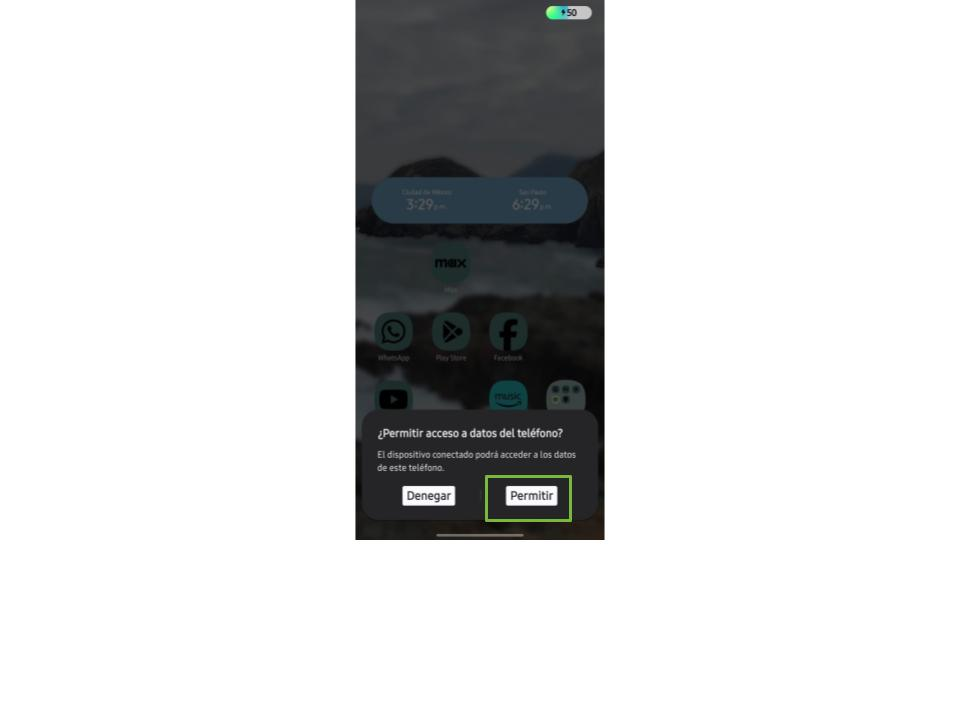
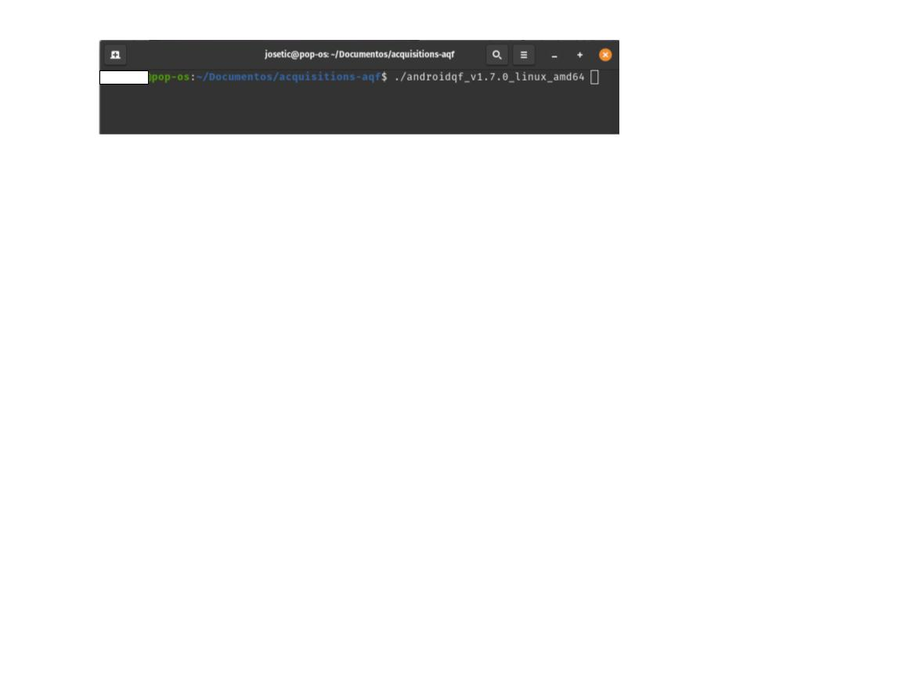
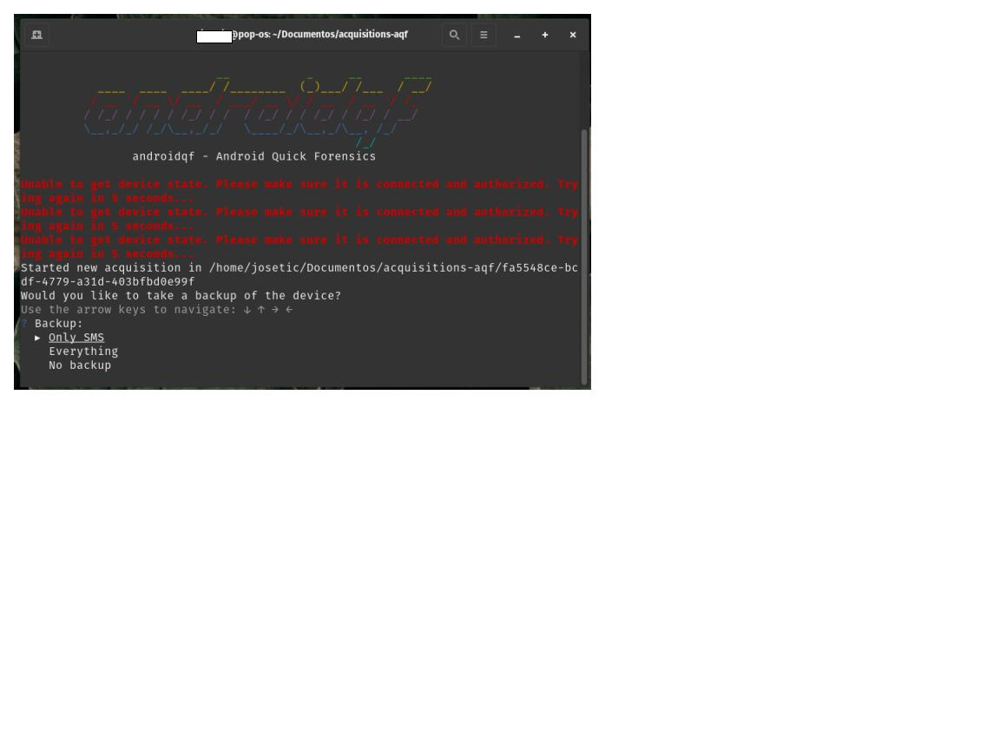
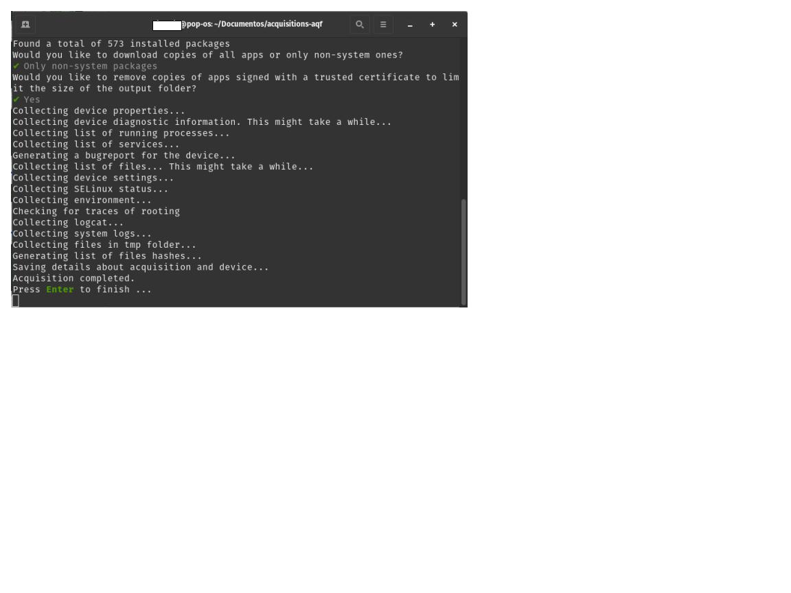
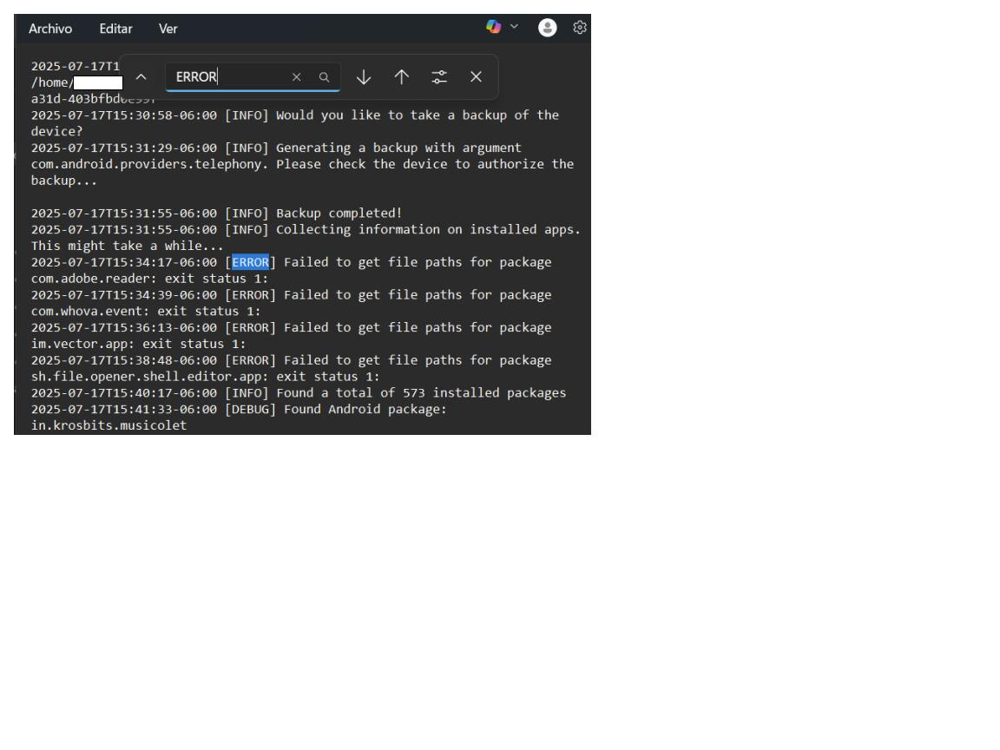
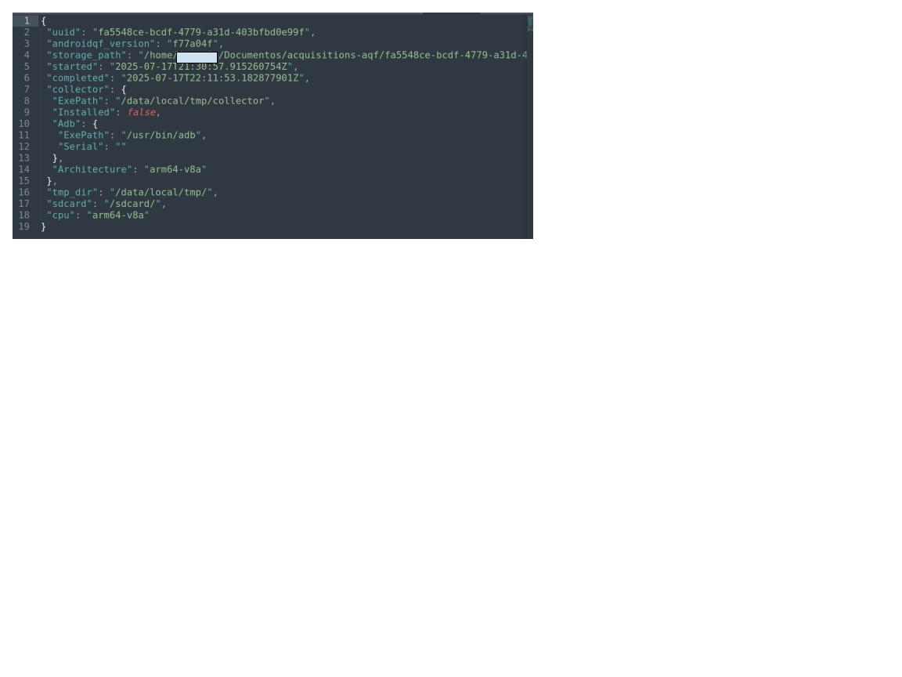
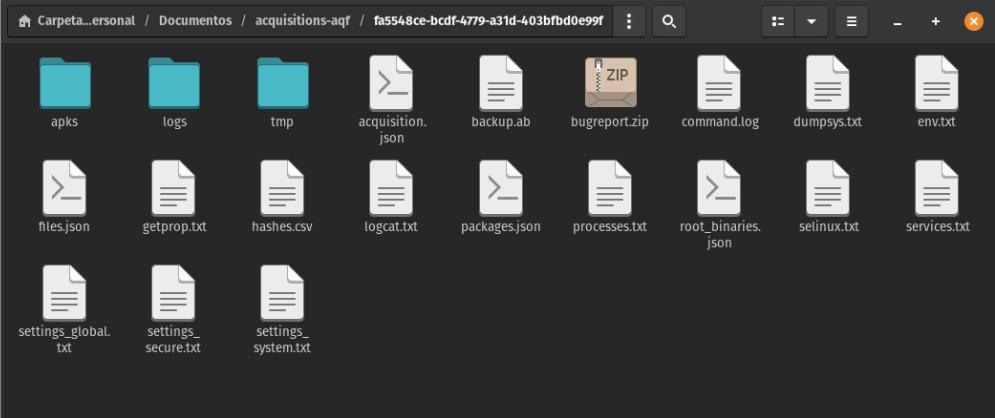

# Guia: ¿Cómo realizar una extracción mediante AndroidQF?

!!! info "Sobre este recurso"

    Esta guía paso a paso presenta las **instrucciones que permiten extraer evidencia forense de dispositivos Android utilizando la herramienta AndroidQF** para un posterior análisis.   


Este documento forma **parte de un repositorio de documentación técnica** que tiene como objetivo establecer una base de conocimientos probados, flexibles y accesibles para **impulsar el análisis forense consentido en beneficio de la sociedad civil**. Para organizar los contenidos, se utiliza el [marco de referencia de documentación técnica Diataxis](https://diataxis.fr/).

Este recurso en particular se enmarca dentro de la categoría de [Guia, how-to](../how-tos/), y contiene las instrucciones para realizar una extracción forense con la herramienta [AndroidQF](https://github.com/mvt-project/androidqf).

## ¿Qué es AndroidQF?

[AndroidQF](https://github.com/mvt-project/androidqf) es una herramienta de software libre y de código abierto **enfocada en la extracción forense de dispositivos Android**. Actualmente mantenida por el [Laboratorio de Seguridad de Amnistía Internacional](https://securitylab.amnesty.org/es/). 

Su enfoque está pensado especialmente para periodistas, activistas, defensores de derechos humanos y los **laboratorios técnicos que acompañan casos de vigilancia digital y amenazas de software espía.**

AndroidQF funciona como un [wrapper](https://developer.mozilla.org/en-US/docs/Glossary/Wrapper) forense sobre [ADB](https://developer.android.com/tools/adb?hl=es-419), automatizando comandos comunes mediante módulos que **permiten realizar extracciones rápidas, seguras y locales desde cualquier sistema operativo (Linux, Windows o macOS)**, sin depender de servicios en la nube ni instalaciones complejas.

Su utilidad en contextos de sociedad civil radica en su **portabilidad, facilidad de uso y ejecución local.**

Esta guía es complementaria se complementa con otros materiales, como el [diccionario de archivos generados por AndroidQF](../references/01-reference-diccionario-androidqf/01-reference-diccionario-androidqf.md), sus formatos y recomendaciones de uso o el [explainer sobre forense basada en logs para dispositivos Android](../explainers/03-explainer-forense-logs-android/03-explainer-forense-logs-android.md).

## ¿Qué debo preparar antes de una extracción con AndroidQF?

Para poder realizar una extracción con AndroidQF es **indispensable** considerar los siguientes elementos:

* Activar el **modo desarrollador** y **activar la depuración por USB** en el dispositivo Android a ser analizado. De ser necesario, consulta nuestras [guías sobre habilitar opciones de desarrollador](../how-tos/02-como-habilitar-opciones-desarrollador/02-como-habilitar-opciones-desarrollador.md) o [la guía sobre cómo habilitar ADB](#). 
* Conocer cuál es [chip integrado de la computadora WIndows, Linux o Mac que se utilizará para realizar la extracción](https://servernet.com.ar/como-saber-si-mi-procesador-es-amd-o-arm/) 
* Contar con un cable para transferencia de archivos telefono-computadora

## Pasos para obtener un extracción forense con AndroidQF

A continuación se presentan los pasos detallados para realizar la extracción forense:

### 1. Descargar el binario en AndroidQF

1. Descarga la versión más reciente del binario, y que corresponda a la arquitectura del equipo de cómputo donde se va a ejecutar. La descarga se realiza de los releases del repositorio: [https://github.com/mvt-project/androidqf/releases/](https://github.com/mvt-project/androidqf/releases/) 

2. Crea una nueva carpeta para almacenar la exrtacción del dispositivo. Mueve el binario recién descargado a esta carpeta.

### 2\. Asignar permisos de ejecución al binario descargado (solo Linux y macOS)

Si estás utilizando un equipo con Linux o macOS para la extracción, **abre una terminal y navega a la carpeta donde se encuentra el binario.** Luego ejecuta:

**En linux:**

```
chmod +x ./androidqf-linux-???
```

**En macOS:**

```
chmod +x ./androidqf-macos-???
```

En el comando anterior hay que cambiar el nombre *androidqf-linux* o *androidqf-mac* por el nombre completa del binario real descargado en el paso 1.

### 3. Ejecutar AndroidQF 

En este punto es posible ejecutar androidQF siguiendo estas instrucciones:

1. **Conecta**  el dispositivo desbloqueado a la computadora.

2. Cuando se conecte el teléfono, aparecerá un nuevo mensaje. Selecciona **permitir** cuando el dispositivo Android **solicite permiso de acceso a los datos del dispositivo**, tal y como se muestra en la imagen 1.


/// caption
**Imagen 1**. Captura de pantalla de dispositivo móvil Android Samsung solicitando permiso de acceso a datos.
///


3. **Ejecuta** el binario 

**En linux y macOS:**

```
./androidqf-linux
./androidqf-macos
```


/// caption
**Imagen 2**. Captura de pantalla de terminal de linux con ejecución del binario para el inicio de la extracción
///

**En Windows:**

* En la carpeta donde se guardó el binario se puede ejecutar dando doble click primario. Aparecerá una ventana de protección de Windows, da click en **“Más información”** 


/// caption
**Imagen 3**. Captura de pantalla de ventana emergente de protección de Windows.
///

* Selecciona **“Ejecutar de todas formas”**


/// caption
**Imagen 4**. Captura de pantalla de ventana emergente de protección de Windows con la selección de ejecutar de todas formas.
///


### 4. Confirmar y configurar la extracción 


!!! note "Nota"

    A partir de este momento, **los próximos pasos se aplicarán de la misma manera en los 3 sistemas operativos** considerados en este tutorial: Linux, Windows and macOS.

1. Da clic en ***“Permitir siempre desde esta computadora”***  y luego ***“Aceptar”*** o ***“Permitir”*** cuando aparezca el mensaje: ***¿Permitir depuración por USB?***


/// caption
**Imagen 5**. Captura de pantalla de dispositivo móvil Android Samsung solicitando permiso de depuración y confiabilidad al equipo de cómputo para transferir archivos.
///


2. **AndroidQF identificará el dispositivo de forma automática una vez que permita la depuración USB** y generará una carpeta con un identificador único (UUID). En esta carpeta se almacenará la extracción. :material-information-outline:{ title="El nombre de estas carpetas al ser un UUID suele tener nombres como 0caba18f-20a7-48d0-b9ba-724fdaa3ff85." }


3. Posteriormente **AndroidQF preguntará el tipo de respaldo** que realizará la herramienta:

   1. **Only** **SMS**: Realiza un respaldo limitado que incluye solo mensajes SMS y MMS.
   2. **Everything**: Ejecuta un respaldo completo del dispositivo mediante adb backup.
   3. **No** **Backup**: Omite completamente la generación de respaldos; solo extrae otros artefactos vía ADB.


!!! warning "Alternativa"

    Para el ejemplo usamos la opción **Only-SMS** para limitar la extracción únicamente a mensajes, reduciendo la exposición de datos personales innecesarios. Si el **contexto del caso se considera de alto riesgo** o implica investigación más sofisticada se recomienda marcar la opción  **Everything**, aunque la opción **Only-SMS** en la mayoría de los casos sigue siendo suficiente para buscar intentos de phishing mediante SMS.*


/// caption
**Imagen 6**. Captura de pantalla de terminal de linux con el menú backup de AndroidQF y la opción Only SMS seleccionada.
///

4. Al seleccionar el tipo de respaldo, el teléfono solicitará utilizar una **contraseña temporal de cifrado** para este. En nuestro ejemplo utilizamos **la contraseña “sd”** de seguridad digital en español, tal y como se muestra en la imagen 7. 

!!! warning "Alternativa"

    Esta contraseña permite cifrar la copia de seguridad que se genera al ejecutar androidqf. En caso de generar **contraseñas aleatorias**, asegúrate de utilizar un **gestor con adecuadas prácticas de respaldo**. De lo contrario, y sino representa un riesgo, establece una contraseá simple y equivalente para todas tus extracciones.
   

/// caption
**Imagen 7**. Captura de pantalla de dispositivo móvil Android Samsung solicitando la contraseña temporal del backup “sd”
///

5. Selecciona: **“Copia de seguridad de mis datos”.**


/// caption
**Imagen 8**. Captura de pantalla de dispositivo móvil Android Samsung con la opción “Copia de seguridad de mis datos” seleccionada
///

!!! error "Error"

    En algunas ocasiones, suelen aparecer errores sobre la búsqueda de las rutas donde se encuentran los paquetes, por lo que es común ver algunas de estas marcas de error, sin embargo, **estas marcas de error no afectan la extracción de datos forenses en el dispositivo.***


/// caption
**Imagen 9**. Captura de pantalla de terminal de linux indicando la recolección de información de paquetes de aplicaciones por parte de AndroidQF.
///

6. Cuando AndoridQF encuentra todos los paquetes instalados en el dispositivo preguntará qué **tipo de copias de las aplicaciones se desea descargar, para ello hay 3 opciones**:  
     
   1. **All**: Descarga los APK de todas las aplicaciones, incluidas las del sistema.  
   2. **Only** **non-system** **packages**: Descarga solo los APK de aplicaciones instaladas por el usuario.  
   3. **Do** **not** **download** **any**: Omite completamente la descarga de APKs del dispositivo.

!!! warning "Alternativa"

    Aunque nuestra recomendación es seleccionar “Only non-system packages”, la selección depende de tu enfoque de análisis e investigación, por lo que en casos con sospechas de ataques sofisticados se puede utilizar la opción “All”.*


/// caption
**Imagen 10**. Captura de pantalla de terminal de linux con el menú copias de paquetes de aplicaciones de AndroidQF y la opción Only non-system packages seleccionada.
///

7. Una vez seleccionada la opción de descargas de copias de paquetes, **AndroidQF preguntará acerca de eliminar los APKs** firmados por desarrolladores o entidades confiables (como Google o el fabricante del dispositivo), esto con el fin de reducir el tamaño de la carpeta de extracción.

* Responde **“Yes”** para que, al realizar la revisión de la información se pueda **enfocar el análisis en los paquetes que sean potencialmente sospechosos**, además de que ahorrará tiempo y espacio de almacenamiento.

!!! warning "Alternativa"

    Aunque nuestra recomendación es seleccionar “Yes”, la selección depende de tu enfoque de análisis e investigación, por lo que en casos con sospechas de ataques sofisticados se puede utilizar la opción “No”.*


/// caption
**Imagen 11**. Captura de pantalla de terminal de linux con el menú de omisión de aplicaciones con certificado confiable de AndroidQF y la opción Yes seleccionada.
///

8. **Espera** a que todos los módulos de AndroidQF se ejecuten de acuerdo a su programación.

!!! info
    **Esta etapa puede tomar varios minutos**, dependiendo del modelo del teléfono y la cantidad de datos almacenados. El progreso se muestra línea por línea en la terminal y no requiere intervención adicional, salvo al final, donde se debe presionar Enter para completar.


/// caption
**Imagen 12**. Captura de pantalla de terminal de linux con información de ejecución correcta de la extracción forense con AndroidQF y solicitando presionar enter para terminar.
///


### 5\. Verificación de la extracción

Una vez finalizada la ejecución de AndroidQF, es importante **validar que la adquisición se completó correctamente**. Para ello, realiza los siguientes pasos:

1. Abre el archivo command.log con un editor de texto y **busca las palabras warning o error**. Si aparece revisa si corresponden a fallos críticos o eventos no relevantes.

	**En linux/macOS:**

Puedes usar el comando siguiente dentro de la carpeta de la adquisición:

```
grep -i "WARNING\|ERROR" command.log
```


/// caption
**Imagen 13**. Captura de pantalla de terminal de linux con el comando grep para buscar errores en el archivo command.log generado por AndoridQF.
///

	**En Windows:**  

Abre el archivo con “*Bloc de notas”*, selecciona la combinación de teclas **ctrl+b** y escribe ***WARNING*** o ***ERROR*****.**


/// caption
**Imagen 14**. Captura de pantalla de Bloc de notas de Windows con la búsqueda de  errores en el archivo command.log generado por AndoridQF.
///

2. Verifica la **existencia del archivo *acquisition.json*** y que su contenido se vea adecuado.


/// caption
**Imagen 15**. Captura de pantalla de Sublime Text Con la salida del archivo acquisition.json generado por AndoridQF.
///

3. Comprueba la creación de archivos y carpetas de salida. **Asegurate que se hayan generado los siguientes archivos y carpetas:**

```
├── apks/
├── logs/
├── tmp/
├── .json  
├── backup.ab  
├── bugreport.zip  
├── command.log  
├── dumpsys.txt  
├── env.txt  
├── files.json  
├── getprop.txt  
├── hashes.csv  
├── logcat.txt  
├── packages.json  
├── processes.txt  
├── root_binaries.json  
├── selinux.txt  
├── services.txt  
├── settings_global.txt  
├── settings_secure.txt  
└── settings_system.txt  
```



/// caption
**Imagen 16**. Captura de pantalla de la aplicación archivos en PopOS\! mostrando la carpeta de salida de archivos y directorios generados con la extracción forense con AndroidQF.
///

## Conclusión

AndroidQF permite realizar adquirir y extraer evidencia forense de dispositivos Android. Es una **herramienta ampliamente utilizada por laboratorios de la sociedad civil**, debido a su practicidad, simplicidad y portabilidad. En esta guía detallamos el paso a paso a seguir para realizar extracciones utilizando Windows, MacOS o Linux. 

La extracción de potencial evidencia es una de las **[primeras etapas a seguir dentro de una investigación forense](../explainers/01-explainer-introduccion-forense-digital/01-explainer-introduccion-forense-digital.html#cuales-son-las-etapas-de-una-investigacion-forense)**, y es clave para poder iniciar un triaje. A partir de esta información extraída, se puede iniciar una etapa de análisis, ya sea de forma manual ([pudes consultar el diccionario de archivos aquí](../references/01-reference-diccionario-androidqf/01-reference-diccionario-androidqf.html)) o utilizando una herramienta como [MVT](https://docs.mvt.re/en/latest/). 

Si deseas contribuir con el desarrollo, la traducción o difusión de este recurso u otros recursos, **revisa nuestra [sección de comunidad](../comunidad/)** donde encontrarás más información al respecto.
