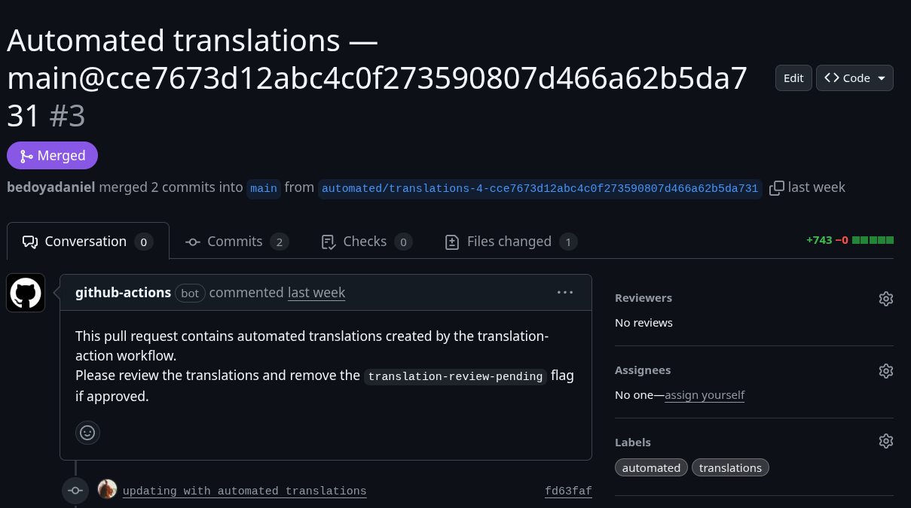
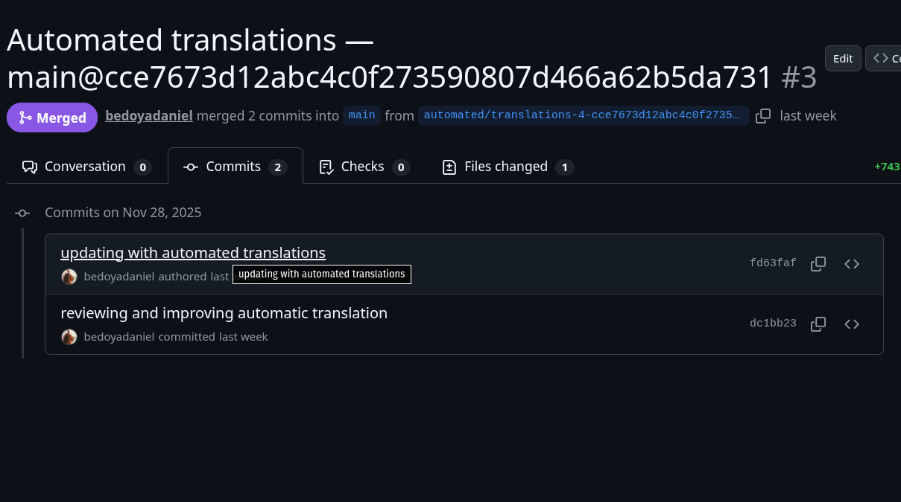
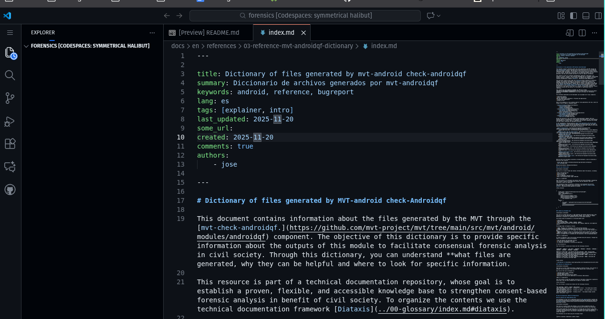

## Introducción

En este documento se describe el uso y la funcionalidad del script de traducción desarrollado para **facilitar el proceso de localización a múltiples idiomas** de este repositorio. El script utiliza la [API de deepl](https://www.deepl.com/en/pro-api) para traducir contenidos en formato [MarkDown](https://es.wikipedia.org/wiki/Markdown), agregando el contenido traduccido como solicitudes de integración o *pull requests*. 

Antes del desarrollo de este script se evaluaron soluciones y marcos de referencia existentes, incluyendo la traducción automátcia neural y modelos como OpenNMT. Se toma la decisión de utilizar el API deepl para facilitar el proceso de implementación. Es posible modificar el script para utilizar otros APIs, como por ejemplo el de [LibreTranslate](https://docs.libretranslate.com/guides/api_usage/).


## Objetivo

A tavés de este script, se pretende: 

* Facilitar el acceso del contenido en este repositorio a comunidades y poblaciones cuyos idiomas no están disponibles
* Reducir el tiempo y esfuerzo necesario para localizar recursos
* Posibilitar e impulsar contribuciones de la comunidad en la traducción y localización de recursos
* Contribuir a mantener versiones equivalentes de contenidos en los diferentes idiomas. 


## Uso

El script tiene dos modos de funcionamiento: con o sin parámetros. 

### Sin parámetros

En el modo sin parámetros, el script busca identificar cambios en los archivos markdown modificados en el último commit, y a partir de dichos cambios inserta traducciones en las líneas correspondientes. En concreto, el script realiza los siguientes pasos: 

* Se identifican archivos modificados en el último git commit  
* Para identificar los idiomas fuente y destino, se revisa la ruta del archivo modificado, para entender cuál es el idioma fuente. Se asume como destino los demás idiomas especificados en la variable ```ALL_LANGS```  
* Se revisa cada archivo individualmente. Si se identifica la bandera “auto-translate”, se toma el archivo como fuente para una 
traducción automática. Si auto-translate se encuentra en false, o no se específica NO se traduce automáticamente.   
    * Si el archivo modificado no está aún traducido, se traduce todo el contenido utilizando el API de deepl y se inserta en la carpeta correspondiente.     
    * Si el archivo modificado ya tiene una traducción, se identifica las líneas modificadas o insertadas y se realiza la traducción utilizando el API de deepl  
    * No se remueven o reemplazan líneas. Si el commit incluye la eliminación de contenido, el script no toma ninguna acción.   
* Todas las traducciones y modificaciones a los archivos se envían como pull requests para revisión

En el caso de este repositorio, se configura también una acción automática en la carpeta de [Workflows](../.github/workflows/) para ejecutar el script cada vez que se hace un commit: 

```
on:
  push:
    branches: ["main"]
    paths:
      - "docs/**"

permissions:
  contents: write      # required to create commits/branches
  pull-requests: write # required to create PRs

jobs:
  translate:
    # Prevent the job from running when the actor is the actions bot to avoid loops
    if: github.actor != 'github-actions[bot]'
    runs-on: ubuntu-latest

    steps:
      - name: Checkout repository
        uses: actions/checkout@v4
        with:
          fetch-depth: 0

      - name: Set up Python
        uses: actions/setup-python@v4
        with:
          python-version: '3.x'

      - name: Install dependencies
        run: |
          python -m pip install --upgrade pip
          pip install deepl

      - name: Run translation script
        env:
          DEEPL_API_KEY: ${{ secrets.DEEPL_API_KEY }}
        run: |
          # run the script - will write translated files to disk
          python scripts/translate.py

      - name: Check for repository changes
        run: |
          # Ensure git is configured so commands work in Actions runner
          git config user.name "github-actions[bot]"
          git config user.email "github-actions[bot]@users.noreply.github.com"

          # Show git status for debugging
          echo "git status --porcelain output:"
          git status --porcelain

          # If there are no changes, exit early (success)
          if [ -z "$(git status --porcelain)" ]; then
            echo "No changes detected after running translation script. Exiting workflow."
            exit 0
          fi

          # Otherwise print files for commit so logs show what will be included
          echo "Detected changes; the following files will be included in the PR:"
          git status --porcelain | sed -e 's/^[ MARC]*/  /'

      - name: Create pull request for translation changes
        uses: peter-evans/create-pull-request@v5
        with:
          # the token will be provided by github actions
          token: ${{ secrets.GITHUB_TOKEN }}
          # commit message used for the branch commit
          commit-message: updating with automated translations
          # branch name — using timestamp/sha avoids collisions
          branch: automated/translations-${{ github.run_number }}-${{ github.sha }}
          title: "Automated translations — ${{ github.ref_name }}@${{ github.sha }}"
          body: |
            This pull request contains automated translations created by the translation-action workflow.
            Please review the translations and remove the `translation-review-pending` flag if approved.
          labels: automated,translations
          draft: true

```

Esta acción automática, además de ejecutar el script, utiliza la acción ```peter-evans/create-pull-request@v5``` para crear una solicitud de integración a fin de revisar la traducción automática. 


### Con parámetros

En el modo con parámetros, el script funciona de la siguiente manera: 


translate.py [-h] [-f FILE] [-s SOURCE_LANG] [-t TARGETS [TARGETS ...]] [-o OUTPUT_DIR]

Translate docs (diff mode or single-file CLI).

options:
  -h, --help            show this help message and exit
  -f FILE, --file FILE  Source file to translate (CLI mode).
  -s SOURCE_LANG, --source-lang SOURCE_LANG
                        Source language code (required only when -f is used).
  -t TARGETS [TARGETS ...], --targets TARGETS [TARGETS ...]
                        Target languages (required only when -f is used).
  -o OUTPUT_DIR, --output-dir OUTPUT_DIR
                        Optional output directory for CLI mode.


Por ejemplo, 

## Ejemplos y comportamiento esperado


### Sin parámetros

Al configurar una acción automática para ejecutar el script se espera el siguiente comportamiento: 

monitorean cambios en los archivos markdown de la carpeta /docs, y al identificar un cambio se revisa el archivo de commit. Si la bandera “auto-translate” del archivo modificado está en true, se procede con la traducción automática tal y como se describe a continuación:

* Si se **agregan** líneas una nueva sección a un documento existente  
  * Si ya tiene traducciones disponibles:   
    * Se traducen las líneas agregadas, se insertan en la versión traducida, se crea pull request para revisión  
  * Si el documento modificado **aún no ha sido traducido**:   
    * Se traduce todo el doc, se crea archivo con versión traducida, se crea pr para traducción  
    * Se agrega la bandera ‘translation-review-pending: true’ al archivo traducido  
      * El archivo recién traducido no se traduce nuevamente hasta que se remueva la bandera
* Si se **modifican** líneas en un documento.   
  * Si ya tiene traducciones disponibles:   
    * Esto se interpretará en el commit como una adición (+) y una remoción (-)  
    * Por lo tanto, la línea agregada se traducirá, e insertará en la versión traducida  y enviará para revisión  
      * Mientras que **la línea removida se mantendrá**, por lo que es importante que quién revise, ajuste según sea necesario.   
  * Si el documento modificado aún no ha sido traducido:   
    * Se traduce todo el doc, se crea archivo con versión traducida, se crea pr para traducción  
    * Se agrega la bandera ‘translation-review-pending: true’ al archivo traducido  
      * El archivo recién traducido no se traduce nuevamente hasta que se remueva la bandera
* Si se **eliminan** líneas de un documento  
  * No se toma ninguna acción


### Con parámetros: 

Al utilizar el script sin parámetros, se tiene control del archivo a traducir, lenguajes fuente y destino. Por lo tanto, describimos el comportamiento esperado a través de un ejemplo. 

Si se desea traducir del español al inglés un documento de nombre 'notas.md' ubicado en la carpeta de Documents/ el comando sería el siguiente: 


```
translate.py -f /home/user/documents/notas.md -s es -t en 

```

El comando anterior, genera el siguiente resultado: 


```
daniel@pop-os:~/Documents/Proyectos/source-repo/forensics/scripts$ python3 translate.py -f ~/Documents/notas.md -s es -t en 
CLI MODE: Translating /home/daniel/Documents/notas.md (es) → ['en']
Written translation: /home/daniel/Documents/notas-en.md
```

Y como resultado, se crea un documento dentro de la carpeta Document/ con el texto traducido del español al inglés. En este caso de ejemplo, estos son los contenidos del archivo fuente y resultante. 


```
cat notas.md

Este es un documento de notas en español. 

cat notas-en.md

---
translation-review-pending: true
---
This is a document of notes in Spanish.
```

Tal y como se observa, el documento generado contiene la traducción, y además la bandera "tanslation-review-pending" establecida en los metadatos de MarkDown. Esta bandera se agrega para hacer transparente el hecho de que el documento fue traducido automáticamente. 


## Revisión de traducciones

Las traducciones generadas por el script son una buena aproximación y facilitan el proceso, pero **requieren de una revisión manual**. Esta revisión debe considerar tanto aspectos de sintáxis y comprensión, así como de formato de markdown.  

La revisión se realizará a través de los *pull requests* o solicitudes de integración que se generan automáticamente. La figura 1  muestra un ejemplo de pull request generado por la acción de traducción continua: 


 

Dentro del *pull request* es posible ver los archivos modificados, navegando a la pestaña de commits, tal y como se muestra en la imagen 2. 

 

 Al hacer click en los archivos modificados, la interfaz nos desplegará el texto traducido y que debe ser revisado. 


 

Es posible revisar el texto utilizando la interfaz web de desarrollo que ofrece github. Para esto, debemos dar click en la opción de *Review in codespace*, lo que abrirá una nueva pestaña donde podremos revisar y modificar el archivo traducido. 

 

Como parte de la revisión, recomendamos revisar y considerar los siguientes aspectos: 

* Revisar la sintáxis y estructura del documento para asegurar que es legible y entendible. 
* Revisar los formatos de MarkDown, correspondiente a la **letra negrita**, *letra cursiva* y listas
* Revisar los enlaces y proponer una versión el el idioma destino, de ser posible.   
